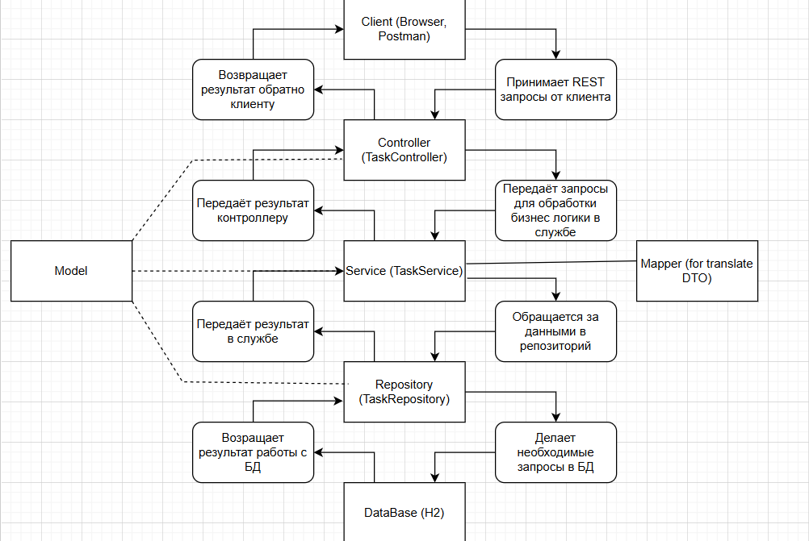

# TaskChecker

**TaskChecker** — это бэкенд-сервис для управления задачами, разработанный на **Kotlin** с использованием **Spring Boot 3**.  
Проект предоставляет REST API с полным CRUD-функционалом, валидацией данных, защитой от дубликатов и глобальной обработкой ошибок.

---

## 🚀 Стек технологий

| Технология | Назначение |
|------------|------------|
| **Kotlin 2.0.20** | Основной язык разработки |
| **Spring Boot 3.3.0** | Фреймворк для создания веб-приложений |
| **Spring Web MVC** | REST API, обработка HTTP-запросов |
| **Spring Data JPA + Hibernate** | ORM, работа с базой данных |
| **Spring Boot Starter Validation** | Валидация входящих данных |
| **Spring Security** | Базовая аутентификация (Basic Auth) |
| **Spring Boot Actuator** | Мониторинг состояния приложения |
| **H2 Database (in-memory)** | Реляционная БД для разработки |
| **HikariCP** | Пул соединений с БД |
| **Gradle (Kotlin DSL)** | Система сборки |
| **Java 21** | Платформа для запуска |

---

## 🏗️ Архитектура

Проект построен на классической трёхуровневой архитектуре **Controller → Service → Repository** с использованием DTO и маппера для разделения API-контрактов и сущностей БД.



---

## 🔌 API Эндпоинты

| Метод | URL | Описание |
|-------|-----|----------|
| `GET` | `/api/tasks` | Получить все задачи |
| `GET` | `/api/tasks/themes` | Получить все уникальные темы |
| `GET` | `/api/tasks/by-id?id={id}` | Получить задачу по ID |
| `GET` | `/api/tasks/by-title?title={title}` | Поиск по названию |
| `GET` | `/api/tasks/by-theme?theme={theme}` | Поиск по теме |
| `GET` | `/api/tasks/by-author?author={author}` | Поиск по автору |
| `GET` | `/api/tasks/is-started` | Получить запущенные задачи |
| `POST` | `/api/tasks` | Создать задачу (JSON `Task`) |
| `PUT` | `/api/tasks/{id}` | Обновить задачу (JSON `Task`) |
| `DELETE` | `/api/tasks/{id}` | Удалить задачу по ID |

---

## 💻 Примеры запросов

### Создание задачи (POST /api/tasks)

```json
{
  "title": "Изучить Kotlin",
  "theme": "Обучение",
  "author": "Алексей",
  "description": "Пройти курс и сделать проект",
  "isStarted": false
}
```
Ответ (201 Created):
  ```json
{
  "id": 1,
  "title": "Изучить Kotlin",
  "theme": "Обучение",
  "author": "Алексей",
  "description": "Пройти курс и сделать проект",
  "isStarted": false,
  "updateAt": "2026-07-07T18:00:00.000Z"
}
```

### Получение всех задач (GET /api/tasks)

Ответ (200 OK):
```json
[
  {
    "id": 1,
    "title": "Изучить Kotlin",
    "theme": "Обучение",
    "author": "Алексей",
    "description": "Пройти курс и сделать проект",
    "updateAt": "2026-07-26T14:43:25.753632",
    "isStarted": false
  }
]
```

### Обновление задачи (PUT /api/tasks/1)

```json
{
  "title": "Изучить Kotlin и Spring",
  "theme": "Обучение",
  "author": "Алексей",
  "description": "Обновлённое описание",
  "isStarted": true
}
```

Ответ(200 OK):
```json
{
    "id": 1,
    "title": "Изучить Kotlin и Spring",
    "theme": "Обучение",
    "author": "Алексей",
    "description": "Обновлённое описание",
    "updateAt": "2026-07-26T14:43:25.753632",
    "isStarted": true
}
```

### Удаление задачи (DELETE /api/tasks/1)
  
Ответ(204 No Content)

## 🔐 Аутентификация
### API защищён с помощью Basic Authentication (Spring Security).

Логин: admin

Пароль: password

Для доступа к защищённым эндпоинтам необходимо добавить заголовок Authorization: Basic ... или использовать встроенную поддержку Basic Auth в Postman / IDEA HTTP Client.

## 🏥 Мониторинг (Actuator)
### Spring Boot Actuator предоставляет эндпоинты для мониторинга состояния приложения:

/actuator/health - Статус здоровья приложения (доступен без аутентификации)\
/actuator/info - Информация о приложении\
/actuator/metrics - Метрики (память, процессор, запросы)\

## 🖥️ H2 Console
### Для просмотра базы данных в реальном времени используй H2 Console:

```text
http://localhost:8080/h2-console
```

JDBC URL: jdbc:h2:mem:testdb\
User Name: sa\
Password: (оставить пустым)\

## 📬 Тестирование через Postman

В папке `/postman` находится экспортированная коллекция запросов.

1. Открой Postman.
2. Нажми **Import** → выбери файл `TaskChecker.postman_collection.json`.
3. Убедись, что авторизация настроена: коллекция использует **Basic Auth** с логином `admin` и паролем `password`.
4. Отправляй запросы и тестируй API.

## 📌 Особенности
✅ Полный CRUD с валидацией (@Valid, @NotBlank, @Size)\
✅ Защита от дубликатов (проверка на уровне сервиса)\
✅ Глобальная обработка исключений (@RestControllerAdvice)\
✅ Автоматическое обновление временной метки (@UpdateTimestamp)\
✅ Чистое разделение слоёв (Controller → Service → Repository)\
✅ DTO + Mapper для изоляции API от сущностей БД\
✅ In-memory БД для быстрой разработки\
✅ Настройка через application.yml\
✅ Базовая аутентификация (Spring Security)\
✅ Мониторинг через Actuator\
✅ Юнит- и интеграционные тесты\


## 🧠 Чему научился в этом проекте
#### Создание REST API на Kotlin + Spring Boot 3
#### Работа с Spring Data JPA и Hibernate
#### Проектирование архитектуры Controller-Service-Repository
#### Валидация данных и обработка ошибок
#### Использование DTO и мапперов
#### Настройка H2 Database и подключение к ней
#### Работа с Gradle (Kotlin DSL)
#### Внедрение Basic Authentication (Spring Security)
#### Настройка мониторинга через Actuator
#### Написание unit тестов для всех слоёв


## 📄 Лицензия
### Этот проект создан в учебных целях. Свободно используйте для портфолио и обучения.

## 🔗 Контакты:
Автор: FeodorH\
GitHub: https://github.com/FeodorH\
Email: fholkin@yandex.ru\
Telegram: @feodorH\
